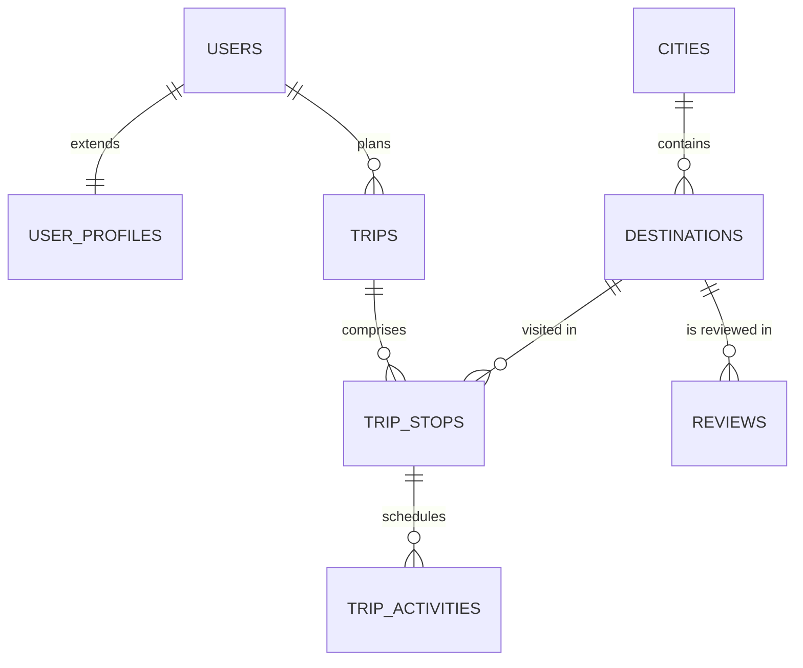

# WanderGuide - Intelligent Travel Planning Application

WanderGuide is a premium, full-stack travel planning application built with **Next.js 15**, **React 19**, and **Supabase**. It empowers users to create multi-stop itineraries, visualize routes in real-time, and get accurate pricing estimations for their journeys.

---

## 🚀 Features

- **Multi-Stop Trip Planner**: Effortlessly add, remove, and reorder destinations in a single trip.
- **Dynamic Routing**: Interactive maps powered by **Leaflet** and **OpenRouteService** showing precise travel paths and markers.
- **Smart Pricing Engine**: Real-time estimated costs for transport, accommodation, and daily activities based on distance and user preferences.
- **Dynamic Content resolution**: High-quality imagery fetched dynamically via a tiered fallback system: **Pexels** -> **Unsplash** -> **Wikimedia Commons**.
- **User Personalization**: Tailwind-styled user profiles that store travel styles and budget preferences to tailor recommendations.
- **Community Reviews**: Integrated feedback and review module for every destination, powered by Supabase real-time updates.

---

## 🛠️ Technical Stack

- **Frontend**: 
  - **Next.js 15 (App Router)**: For server-side rendering and efficient client-side navigation.
  - **React 19**: Utilizing the latest hooks and server components.
  - **TypeScript**: Ensuring high code reliability and type safety.
  - **Tailwind CSS**: For a modern, utility-first UI design.
  - **Framer Motion**: For smooth transitions and engaging micro-interactions.
  - **Shadcn UI**: A collection of high-quality components built on Radix UI.

- **Backend & Database**: 
  - **Supabase (PostgreSQL)**: Managed database with high availability.
  - **Supabase Auth**: Secure authentication flow for user profiles and trip data.
  - **Next.js API Routes**: Server-side logic for external API orchestration and data processing.

- **Mapping & Geospatial**: 
  - **Leaflet.js**: The industry standard for mobile-friendly interactive maps.
  - **OpenRouteService API**: Providing advanced multi-stop routing logic.
  - **Geoapify API**: Powering location search, autocomplete, and geocoding.

---

## 🗄️ Database Architecture

The project utilizes a robust relational schema in Supabase to manage user relationships and complex travel data.

### ER Diagram


### Core Entities
- **cities**: Stores regional metadata, coordinates, and state information.
- **destinations**: Comprehensive data for points of interest including categories, ratings, and entry constraints.
- **trips**: The container for user-created itineraries, tracking status (planning/upcoming) and budgets.
- **trip_stops**: Maintains the ordered sequence of destinations within a trip journey.
- **trip_activities**: Tracks granular daily plans, estimated costs, and completion status.
- **user_profiles**: Stores user-specific travel persona and preferences.

---

## 🔌 API Integrations

- **Geoapify**: Handles the destination search engine and mapping coordinates.
- **OpenRouteService**: Computes distance, time matrices, and visual route paths for multi-stop journeys.
- **Pexels / Unsplash**: Resolves dynamic hero imagery for destinations where local static assets are unavailable.

---

## ⚙️ Setup and Installation

### Prerequisites
- Node.js 18+
- pnpm (recommended) or npm
- A Supabase account and project

### Steps
1. **Clone the repository**:
   ```bash
   git clone https://github.com/DakshinKarthick/WanderGuide
   cd WanderGuide
   ```
2. **Install dependencies**:
   ```bash
   pnpm install
   ```
3. **Environment Configuration**:
   Create a `.env.local` file in the root directory and add:
   ```env
   NEXT_PUBLIC_SUPABASE_URL=your_supabase_project_url
   NEXT_PUBLIC_SUPABASE_ANON_KEY=your_supabase_anon_key
   GEOAPIFY_API_KEY=your_geoapify_key
   OPENROUTESERVICE_API_KEY=your_openrouteservice_key
   PEXELS_API_KEY=your_pexels_key (optional)
   UNSPLASH_ACCESS_KEY=your_unsplash_key (optional)
   ```
4. **Database Setup**:
   Run the migration scripts located in `supabase/migrations/` sequentially in your Supabase SQL Editor.
5. **Run Development Server**:
   ```bash
   pnpm dev
   ```
   Open [http://localhost:3000](http://localhost:3000) to view the application.

---

## 📄 License
This project is licensed under the MIT License - see the LICENSE file for details.
